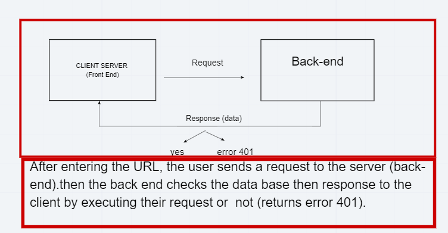

# city-exlplorer-back

# Project Name

**Author**: Dania Abughoush
**Version**: 1.0.0 (increment the patch/fix version number if you make more commits past your first submission)

## Overview
its application to provid weather and map 

## Getting Started
npm start
nodemon

## Architecture
API
cors
doteven

## Change Log
5/5/2021:proovided feature from backend weather to displayed in frontend

## Credit and Collaborations
<!-- Give credit (and a link) to other people or resources that helped you build this application. -->

Name of feature:express npm_____________________

Estimate of time needed to complete: ___10h__

Start time: _2:00pm____

Finish time: _2:00am next day____

Actual time needed to complete: __9hours__